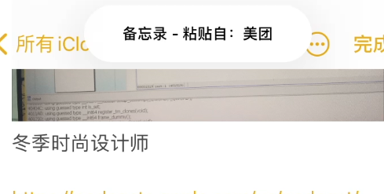

# PasteBoardChecker

本文档总结下ios14.6版本的完整阶段从Frida Hook→Tweak编写的完整过程

- 本文所需要的基础设备如下：
- 测试机器：iphone7 ios14.6（已越狱）
- 代码编译：macOS 26.4

作为一名刚入门的ios玩家，本文内容可能会有错误的地方 

# 确定目标



> 在ios14 之后当你从应用A复制的内容将要粘贴到应用B的时候，此时会出现上面的小窗口来显示粘贴内容的来源与目的地，那么既然粘贴已经存在了消息提醒，那么我想添加一个小功能那就是在复制的时候弹出窗口，因此选定目标为系统的通用剪贴板
> 

在苹果官网中可以看到相关信息

https://developer.apple.com/documentation/uikit/uipasteboard?language=objc

这里**仅仅拿objc**作为学习对象

- `UIPasteboard` 官方文档介绍
    
    **An object that helps a user share data from one place to another within your app, and from your app to other apps.**
    

> In typical usage, an object in your app writes data to a pasteboard when the user requests a copy, cut, or duplicate operation on a selection in the user interface. Another object in the same or different app then reads that data from the pasteboard and presents it to the user at a new location. This usually happens when the user requests a paste operation.
> 

要与其他应用分享数据，需要使用到系统级别的剪切板，当用户请求对指定区域进行复制/剪切等操作的时候会将数据写入剪切板，然后统一应用和不同应用的对象将会从剪切板读出数据，并显示在新的位置

他是位于UIKit框架下的UIPasteboard类，开发者也通常会直接使用该API来完成相关复制操作，所拥有的方法中从官网查看到的信息有不同的主题，这里仅贴出本文中考虑/用到的部分

## [获取和删除剪贴板](https://developer.apple.com/documentation/uikit/uipasteboard?language=objc#Getting-and-removing-pasteboards)

- `generalPasteboard`
    
    系统范围的通用剪贴板，主要用来进行copy-paste操作
    
    ```objectivec
    @property (class, nonatomic, readonly) UIPasteboard * generalPasteboard;
    ```
    

## [获取和设置剪贴板项](https://developer.apple.com/documentation/uikit/uipasteboard?language=objc#Getting-and-setting-pasteboard-items)

- `numberOfItems`
    
    返回剪贴板中的Item数量
    
    ```objectivec
    @property (nonatomic, readonly) NSInteger numberOfItems;
    ```
    
- `items`
    
    剪切板上面的单位
    
    ```objectivec
    @property (nonatomic, copy) NSArray<NSDictionary<NSString *,id> *> * items
    ```
    
- `- addItems`
    
    添加Item到剪贴板当中
    
    ```objectivec
    - (void) addItems:(NSArray<NSDictionary<NSString *,id> *> *) items;
    ```
    
- `- setItems:options:`
    
    将一系列项目添加到剪贴板， 并为剪贴板上面的所有项目设置隐私选项
    
    ```objectivec
    - (void) setItems:(NSArray<NSDictionary<NSString *,id> *> *) items 
              options:(NSDictionary<NSString *,id> *) options;
    ```
    

## [获取和设置标准数据类型的剪贴板项](https://developer.apple.com/documentation/uikit/uipasteboard?language=objc#Getting-and-setting-pasteboard-items-of-standard-data-types)

- `string`
    
    第一个剪贴板项的字符串值
    
    ```objectivec
    @property (nonatomic, copy) NSString * string;
    ```
    
- `image`
    
    第一个剪贴板Item的图像对象
    
    ```objectivec
    @property (nonatomic, copy) UIImage * image;
    ```
    
- `URL`
    
    第一个剪贴板项的URL对象
    
    ```objectivec
    @property (nonatomic, copy) NSURL * URL;
    ```
    

## [获取和设置项目提供商](https://developer.apple.com/documentation/uikit/uipasteboard?language=objc#Getting-and-setting-item-providers)

- `itemProviders`
    
    剪贴板的一系列项目提供者
    
    ```objectivec
    @property (nonatomic, copy) NSArray<__kindof NSItemProvider *> * itemProviders; 
    ```
    
- `setItemProviders:localOnly:expirationDate`
    
    设置并配置剪贴板的显式项目提供程序数组
    
    ```objectivec
    - (void) setItemProviders:(NSArray<NSItemProvider *> *) itemProviders 
                    localOnly:(BOOL) localOnly 
               expirationDate:(NSDate *) expirationDate;
    ```
    

# 寻找hook函数

在大致过完一遍官方文档之后，我们需要首先确定哪个函数在真正调用的时候将会触发，因此我们使用Frida/objection来方便的Hook来寻找函数

```bash
ios hooking watch class UIPasteboard --dump-args --dump-return
```


通过上面的objection命令可以hook所有该`UIPasteboard`类下的方法，然后我们在应用中点击复制即可检测出下面的内容


发现其中有`UIPasteboard` 和 `_UIConcretePasteboard`  两个类中的方法出现响应，考虑到后者的方法名是safari自己实现的防范并且似乎不像写入剪贴板的操作，因此选择继续hook 前者的get操作

由于看了上面的官方文档，我们知道了`generalPasteboard` 实际上是一个get命令,因此我们查看一下该方法的返回值类型看是否属于是`UIPasteboard` ，从这里看到没有相关拷贝的方法可以初步推断应该是属于他的一个子类,通过frida打印返回值的`.$className` 


因此这里的操作是获取了一个`_UIConcretePasteboard` 类型的对象，肯能真正的操作在该子类中进行了重写，从他的命名规则可以初步判断该类是由Apple自行开发的，因此我们重新用objection hook该子类的所有方法来查看复制的整个过程


可以看到该子类确实调用了`setString` 这种明显是写入剪切板Item的方法，因此我们修改Frida脚本监控相关的函数

# 类簇（class cluster）

在上述Hook的过程中，我遇到了以下几个问题：

1. 为什么在hook `UIPasteboard`这个类但是出现了 `_UIConcretePasteboard` 这个类的方法
2. 为什么仅仅在hook UIPasteboard这个类的过程中，日志显示仅仅只有 `[UIPasteboard generalPasteboard]` 这个方法和 `[_UIConcretePasteboard]` 的几种方法呢，似乎没有需要的`setString,setItem, setItemProviders` 这些对于复制到剪切板里面的强相关的方法呢
3. 为什么`generalPasteboard` 这个方法的返回值的对象类型是 `_UIConcretePasteboard` 

首先就需要了解一下Objective-C中的类簇概念，简单的来说就是公共抽象父类和私有的具体子类的对应关系，

类簇是基于抽象工厂设计模式的，工厂模式可以分为简单工厂、工厂、抽象工厂

- 简单工厂模式：定义一个工厂类，然后可以根据传入参数的不同来返回不同的实例，被创建的实例具有共同的父类或者接口
- 工厂模式：针对不同的对象提供不同的工厂
- 抽象工厂模式：提供创建一系列相关或者相互依赖对象的接口，而无需指定具体的类

常见的类簇有 `NSString,NSArray,NSDictionary` ，以NSString为例子，不管创建的是可变数组还是不可变数组，alloc之后得到的类都是 `NSPlaceholderString` ，此时分配了内存空间但还没有真正实例化对象，直到真正init了之后才会将对象改为 `__NSCFConstantString` 或者是`__NSCFString` 这种子类型

因此我们可以现在回答问题三，在generalPasteboard 这个方法中可能是调用了 `return [[UIPasteboard alloc] init]` ,而真正实例化的类簇子对象类型是`_UIConcretePasteboard` 

而问题一中，在hook了 `UIPasteboard`这个类的所有方法的时候，objection里面就可以看到`- safari_*` 这样的实例方法，那就说明实际上触发的是父类所增加的方法，但是由于触发的对象类别是 `_UIConcretePasteboard` ,因此在打印日志的时候出现上述情况

上述问题解决后，第二个问题也可以知道，由于我们实际上hook的是父类的方法，但是从`generalPasteboard` 方法返回的是子类型的对象，因此我们可以判定真正的实现代码已经被子类型重写，因此我们真正需要hook的是子类型`_UIConcretePasteboard`

# ios 剪切板设计原理

接下来我们需要对真正的类下的方法进行hook，在后续的Frida测试当中，发现基本有三类复制时将会触发的操作

- set*
- setItem
- setItemProvider

## set*

在setString这类方法调用的时候仅仅可以获取他的第一个方法参数即可获取对应复制的内容

```jsx
        if (UIConcretePasteboard["- setString:"]) {
            console.log("\n 触发setString:");
            Interceptor.attach(UIConcretePasteboard["- setString:"].implementation, {
                onEnter: function(args) {
                    var str = new ObjC.Object(args[2]);
                    console.log("\n[主动写入] App 正在向系统剪贴板写入文本 -> [" + str.toString() + "]");
                }
            });
        }
```

但是在Apple官方文档并没有看到这个方法介绍，仅仅是通过objection在hook的过程中发现的

## setItems

现在来看setItem，该方法可以在测试备忘录复制的时候触发，`Item`这个单位在Apple官方文档里面显示的是一种key为`NSString *` ， value 为 `id` 的`NSDictionary` 的指针，然后`setItems`就是将打包好的`Items`数组作为方法参数传递，因此我们想要获取添加到剪贴板的内容只需要通过hook该方法来遍历这个数组即可

> 复制的内容为什么会作为数组的形式来传递参数呢？难道不应该复制字符串就传递字符串类型就可以了吗？
> 

要解决上面的问题，可以编写一个简单的Frida脚本来查看字典的内容,经过测试发现是 `__NSSingleObjectArrayI` ，

监控得到的类型如下：

```jsx
Items: __NSSingleObjectArrayI
Item: __NSDictionaryM
Key:__NSCFConstantString
Value:NSConcreteMutableData
```

在备忘录应用中复制内容，读出的字典key值存在下列几种

- `com.apple.notes.richtext`
- `ios rich content paste pasteboard type`
- `com.apple.flat-rtfd`
- `public.html`
- `com.apple.webarchive`
- `public.utf8-plain-text`
    
    对于`utf8-plain-text`进行解码即可获取复制到的简单文本内容，至于为什么一次复制需要生成如此多的类型，可能是需要兼容不同的应用，例如粘贴到备忘录可能需要处理`webarchive`或者类型的对象，而如果是简单的获取文本字符串的应用可能就需要的是`plain-text`对象
    
    在本次的实验中我仅仅打印了简单的文本和html内容
    
    
    

## setItemProviders

当我继续分析这个方法的时候，网上搜索到的信息是objection原来已经实现了一个类似的 ☹️,然后我立即去使用了一下


其中发现了一个问题，objection并没有实时的监控所有的复制操作，而是间断的查询剪切板中的内容，因为我在极短的时间内同时复制了新值但是打印的总是最新复制的,查看命令的介绍如下：

- `ios pasteboard monitor` 命令介绍
    
    ```jsx
    Command: ios pasteboard monitor
    
    Usage: ios pasteboard monitor
    
    Hooks into the iOS UIPasteboard class and polls the generalPasteboard every
    5 seconds for data. If new data is found, different from the previous poll,
    that data will be dumped to screen.
    
    Examples:
       ios pasteboard monitor
    ```
    

这里继续讲解本章节的方法。在许多应用中触发的并不是`setItems`这样的方法，而是`setItemProviders`，因此我们考虑hook该程序获取对应的返回值类型


这里发现返回的值类型为 `__NSSingleObjectArrayI` 

数组里面的内容类型是`NSItemProvider` ,然后翻阅官方文档可以得知相关内容

- `NSItemProvider`
    
    用于在拖放或复制粘贴活动期间，或从宿主应用程序到应用程序扩展程序，在进程之间传递数据或文件的`ItemProvider`。
    
    ```objectivec
    @interface NSItemProvider : NSObject
    ```
    
    然后使用下面的属性来获取ItemProvider的数据类型
    
    - **`registeredTypeIdentifiers`**
        
        Returns the array of type identifiers for the item provider, in the same order they were registered.
        
        ```objectivec
        @property (atomic, copy, readonly) NSArray<NSString *> * registeredTypeIdentifiers;
        ```
        
    
    发现测试的几种复制场景涉及到的类型是`public.utf8-plain-text` 
    
    那么接下来需要查看官方文档来看如何通过该Provider来获取剪贴板内容，发现有一个Loading the proider’s contents 的章节讲了一下通过provider来异步的获取内容的
    
    ### [Loading the provider’s contents](https://developer.apple.com/documentation/foundation/nsitemprovider?changes=latest_m_8&language=objc#Loading-the-providers-contents)
    
    这里需要提供一个函数作为参数传递给该API接口，可以再frida中使用闭包来传递
    
    ```objectivec
    provider.loadDataRepresentationForTypeIdentifier_completionHandler_(currentType, handler);
    
    ```
    

# 编写Tweak

可以使用Theos项目来简单的创建一个Tweak项目，使用logos语法来编写hook函数的细节

在将Frida的hook流程集成到tweak项目中后，我们可以查看一下编译完成的dylib文件的细节,首先查看所用到的动态链接库

```bash
❯ otool -L ./testTweak.dylib
./testTweak.dylib:
        /Library/MobileSubstrate/DynamicLibraries/testTweak.dylib (compatibility version 0.0.0, current version 0.0.0)
        /usr/lib/libobjc.A.dylib (compatibility version 1.0.0, current version 228.0.0)
        /System/Library/Frameworks/Foundation.framework/Foundation (compatibility version 300.0.0, current version 4201.0.0)
        /System/Library/Frameworks/CoreFoundation.framework/CoreFoundation (compatibility version 150.0.0, current version 4201.0.0)
        /usr/lib/libSystem.B.dylib (compatibility version 1.0.0, current version 1356.0.0)
        /Library/Frameworks/CydiaSubstrate.framework/CydiaSubstrate (compatibility version 0.0.0, current version 0.0.0)
        /System/Library/Frameworks/UIKit.framework/UIKit (compatibility version 1.0.0, current version 9126.2.4)
```

`/Library/Frameworks/CydiaSubstrate.framework/CydiaSubstrate` 这个库说明他是基于该库来运行的，所以需要保证我们的越狱iphone上面有该库,然后我们可以通过nm来查看导出的符号，这里仅贴出于tweak编写相关的内容

```bash
0000000000004000 t __logosLocalInit
0000000000004198 t __logos_method$_ungrouped$_UIConcretePasteboard$setImage$
0000000000004a4c t __logos_method$_ungrouped$_UIConcretePasteboard$setItemProviders$
0000000000004394 t __logos_method$_ungrouped$_UIConcretePasteboard$setItems$
00000000000040c8 t __logos_method$_ungrouped$_UIConcretePasteboard$setString$
0000000000004248 t __logos_method$_ungrouped$_UIConcretePasteboard$setURL$
000000000000c2b0 b __logos_orig$_ungrouped$_UIConcretePasteboard$setImage$
000000000000c2c8 b __logos_orig$_ungrouped$_UIConcretePasteboard$setItemProviders$
000000000000c2c0 b __logos_orig$_ungrouped$_UIConcretePasteboard$setItems$
000000000000c2a8 b __logos_orig$_ungrouped$_UIConcretePasteboard$setString$
000000000000c2b8 b __logos_orig$_ungrouped$_UIConcretePasteboard$setURL$
```

可以看到部分的`__logos_method_*`和`__logos_orig_*` ,分别位于text段和bss段，前者就是我们所编写的hook逻辑，在hook逻辑当中会将位于bss段上的地址作为函数进行调用,这一部分在下面的lldb调试过程中可以看到


由于苹果有严格的代码签名机制，如果是直接修改磁盘上的代码将会触发AMFI机制导致应用闪退

使用lldb来调试运行程序查看hook的原理，可以查看attach进程的内存空间所依赖的动态库能够找到我们编写的tweak库还有加载tweak的cydia substrate， 使用`(lldb) image list`

```bash
[652] 81BB5C9E-398D-3D4A-9AF5-A98101C9BF6A 0x0000000100b74000 /usr/lib/substrate/SubstrateLoader.dylib (0x0000000100b74000)
[653] 2C01B484-F05C-3B68-970A-C088154870C8 0x0000000100bf4000 /usr/lib/substrate/SubstrateInserter.dylib (0x0000000100bf4000)
[654] 6C1E6937-4C55-35E3-9B4C-00EFFB9E5BC2 0x0000000100e00000 /usr/lib/libsubstrate.dylib (0x0000000100e00000)
[655] 1DB66B74-AD75-4C7B-922D-7BEBE9215D9B 0x0000000100f8c000 /Library/MobileSubstrate/DynamicLibraries/testTweak.dylib (0x0000000100f8c000)
```

此时可以查看方法名，然后通过方法名或者地址来查看反汇编代码

```bash
(lldb) image lookup -r -n '-\[_UIConcretePasteboard .*\]'
(lldb) disassemble -n "-[_UIConcretePasteboard setItems:]" -c 10
```

# 效果演示

最终将复制到的内容作为弹窗的形式来显现，同时也做了一个将内容转发给外部浏览器的小功能，这里直接用的webhook提供的网站


